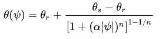
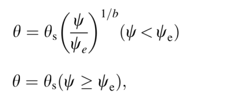
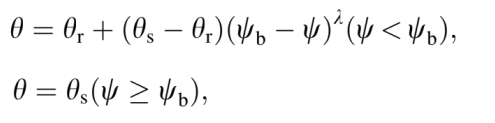

# 📌 برنامج منحنى الوصف الرطوبي Soil Tension Curve Calculator

تم الاستفادة من خصائص مكتبة **Tkinter** لعمل برنامج ميسر لإدخال البيانات من أجل الحصول على أفضل تمثيل رياضي لمنحنى الوصف الرطوبي.  
البرنامج يعمل على تبسيط وتسهيل عملية إدخال البيانات واختيار القيم الأولية لكل نموذج رياضي كما هو موضح في الشكل التالي.

---

## 🧾 نظرة عامة على واجهة المستخدم

يتألف البرنامج من ثلاثة أقسام رئيسية:

 **الخانة اليمنى:**  
   تعرض المعادلات الرياضية لكل نموذج بصورة توضيحية.

 **الخانة العليا في الجهة اليسرى:**  
   - اختيار ملف البيانات (CSV أو TXT)  
   - تحديد عمود المحتوى الرطوبي  
   - تحديد عمود الشد الرطوبي  
   - اختيار النموذج الرياضي

 **الخانة السفلية في الجهة اليسرى:**  
   تحتوي على القيم الأولية لكل نموذج رياضي ويجب إدخالها قبل تنفيذ العملية الحسابية.
   

---

## 📊 تشغيل النموذج

### 🔸 البيانات المطلوبة
عند تشغيل البرنامج:

- يتم إدخال ملف البيانات بصيغة CSV يحتوي على عمودين:
  - عمود للمحتوى الرطوبي
  - عمود للشد الرطوبي

- يتم اختيار **نوع النموذج الرياضي** المستخدم من القائمة المتاحة (Van Genuchten, Campbell, Brook and Corey).

---

## ⚙️ النماذج الرياضية وكيفية استخدامها

### 🔹 نموذج Van Genuchten

- تم وضع معادلة Van Genuchten في دالة تسمى `VG`.
- 

- المعادلة تستخدم القيم التالية:
  - \( θ_s \): المحتوى المائي عند التشبع
  - \( θ_r \): المحتوى المائي المتبقي
  - \( α \): معامل
  - \( n \): معامل

- تُستخدم الدالة `curve_fit` من مكتبة `scipy.optimize` لعمل الانحدار غير الخطي.

- يتم الحصول على مخرجات:
  - **Covariance Matrix**
  - **Fitting Parameters**
  - **قيم t و درجات الحرية**
  - **Pseudo R2**
  - **Residuals**
### 🔹 نموذج Campbell

- تم وضع معادلة **Campbell** في دالة تسمى `Campbell`.
- 
- المعادلة تستخدم المتغيرات التالية:
  - \( θ_s \): المحتوى المائي عند التشبع
  - \( Ψ_e \): **Air entry value** (جهد دخول الهواء إلى مسامات التربة)
  - \( b \): ثابت يعبر عن توزيع حجم المسام

- تُستخدم الدالة `curve_fit` من مكتبة `scipy.optimize` لعمل الانحدار غير الخطي.

- يتم الحصول على مخرجات:
  - **Covariance Matrix**
  - **Fitting Parameters**
  - **قيم t ودرجات الحرية**
  - **Pseudo R2**
  - **Residuals**

### 🔹 نموذج Brook & Corey

- تم وضع معادلة **Brook & Corey** في دالة تسمى `BC`.
- .
- 
- المعادلة تعتمد على المتغيرات التالية:
  - \( θ_s \): المحتوى المائي عند التشبع
  - \( θ_r \): المحتوى المائي المتبقي
  - \( Ψ_b \): **Bubbling pressure** (الجهد عند نقطة دخول الهواء)
  - \( λ \): معامل القوة (متعلق بتوزيع حجم المسام)

- تُستخدم الدالة `curve_fit` من مكتبة `scipy.optimize` لعمل الانحدار غير الخطي.

- يتم الحصول على مخرجات:
  - **Covariance Matrix**
  - **Fitting Parameters**
  - **قيم t ودرجات الحرية**
  - **Pseudo R2**
  - **Residuals**
